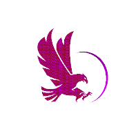

  

<h1 align="center">
  
</h1>

  <strong>Elite Offensive Security Team</strong> 
  
  
  
  

---

## 🧬 Who We Are

**RaptX** is a high-performance cybersecurity team composed of cybersecurity professionals, ethical hackers, CTF players, and enthusiastic beginners. We're a global community where individuals grow together — through competition, collaboration, and continuous learning.

We believe in a strong team culture rooted in trust, mastery, and drive. Every member brings something unique, and together we push the boundaries of cybersecurity.

---

## 🌟 What We Do

At our core, we’re a **community of learners and builders**. We grow together through:

- Competing in CTFs alongside the world’s best.
- Developing custom tools for penetration testing and vulnerability research.
- Providing mentoring, training, and knowledge-sharing sessions.
- Staying at the cutting edge of vulnerability discovery and exploit development.
- Applying our skills to solve real-world security problems.
- Security research, bug hunting for CVEs, and much more.

**Stay sharp, stay fast, stay dangerous — together.**

---

## 🧠 Our Values

- **Tight-Knit Culture** — Low ego, high signal. We win as a team.
- **Real-World Impact** — Tools and tactics that make a measurable difference.
- **Growth Obsessed** — Learn fast, fail smart, and constantly improve.
- **Ethics First** — All operations are guided by strong ethical principles.

---

## 📫 Reach Out

Have a project in mind, questions, or just want to connect?

Reach out to us at: [contact@raptx.org](mailto:contact@raptx.org)

---

## 🔥 More about us

- CTFtime: [RaptX](https://ctftime.org/team/357584)
- HackTheBox: [RaptX](https://app.hackthebox.com/teams/overview/6565)
- Website: [raptx.org](https://raptx.org/#)

---

  <strong>🛡 Security Is Our Playground — Come Play, Learn, and Contribute! </strong>

  
